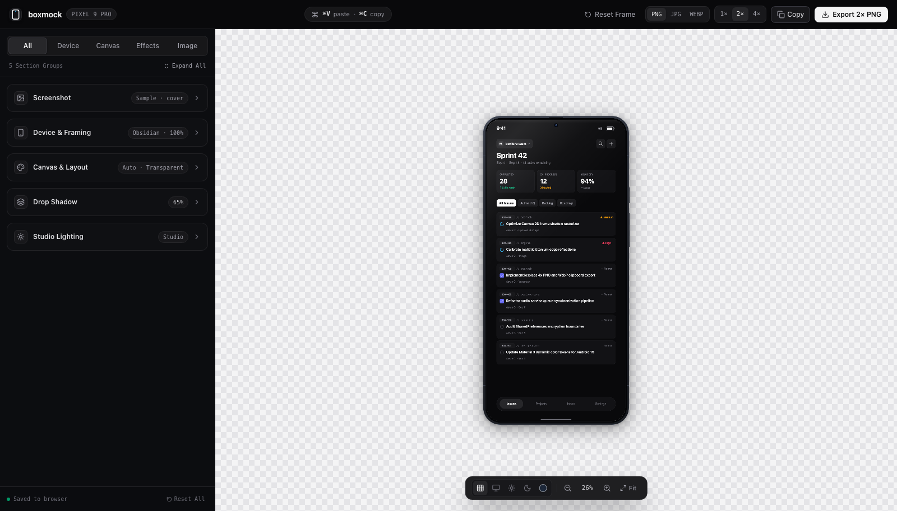
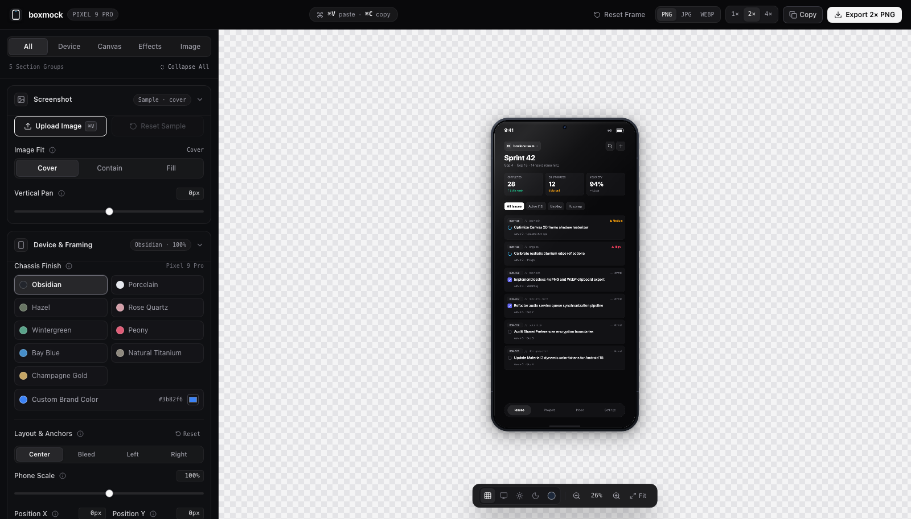

# boxmock — Free Online Phone Mockup Creator & Device Frame Generator

> **Ultra-realistic, browser-based Google Pixel 9 Pro device mockup creator with dynamic studio lighting, authentic finishes, elevation shadows, and high-resolution export.**

[](https://aswin.cx/boxmock/)
[](LICENSE)
[](https://react.dev)
[](https://www.typescriptlang.org/)
[](https://tailwindcss.com/)
[](https://aswin.cx/boxmock/)

---

<div align="center">
  
</div>

---

## 💡 What is boxmock?

**boxmock** is a free, open-source online **phone mockup creator** and device frame generator built for mobile developers, UI/UX designers, and indie hackers. It allows you to transform raw app screenshots into publication-ready showcase assets for the **Apple App Store**, **Google Play Store**, **Product Hunt**, pitch decks, and social media.

Unlike traditional mockup tools that lock high-resolution downloads behind paywalls or require heavy 3D software like Blender, **boxmock runs 100% inside your browser using HTML5 Canvas 2D**. Your images never touch an external server.

---

## 📸 Screenshots & Showcase

### 🎛️ Full Control Over Lighting, Finishes, & Shadows
<div align="center">
  
</div>

### 🌑 Studio Dark Environment with Specular Highlights
<div align="center">
  
</div>

---

## ⚡ Why boxmock? (Feature Comparison)

| Feature | boxmock | Typical Online Mockup Tools |
| :--- | :---: | :---: |
| **Pricing** | **100% Free** | Freemium / Paid Subscription |
| **Watermarks** | **None** | Yes (Free tier watermarked) |
| **Sign-up Required?** | **No** | Yes |
| **Privacy & Security** | **100% Client-Side** (No uploads) | Uploads screenshots to cloud |
| **Hardware Accuracy** | **Authentic Pixel 9 Pro** (Bezels, visor, antennas) | Generic / Outdated phone outlines |
| **Studio Lighting Engine** | **Dynamic Multi-Directional** | Flat / Static gradient overlays |
| **Elevation & Contact Shadows** | **Multi-layer realistic physics** | Basic single drop shadow |
| **Export Formats** | **1×, 2×, 4× PNG, WebP, JPG, Clipboard** | Low-res only on free tier |
| **License** | **GNU GPL-3.0 (Open Source)** | Closed-source proprietary |

---

## 🌟 Key Features

### 📱 Authentic Pixel 9 Pro Geometry
- Exact 120Hz display proportions and curvature.
- Precision front camera punch-hole with lens reflection.
- Micro-slit top speaker ear piece.
- Metallic antenna bands aligned with physical device specs.
- Signature rear visor camera bump silhouette.

### 💡 Dynamic Studio Lighting Simulation
- **Lighting Presets**: Ambient Soft, Studio Direct, Dramatic Rim, Cyberpunk Neon, and Warm Golden Hour.
- **Multi-angle Light Source**: Configurable light position, specular highlights, and edge reflections.
- **Lighting Scopes**: Apply lighting to the entire frame, the screen glass only, or the surrounding canvas.

### 🎨 Physics-Based Finishes
- Choose from authentic device colorways:
  - **Obsidian** (Deep stealth matte black)
  - **Porcelain** (Clean ceramic white)
  - **Hazel** (Muted modern sage)
  - **Rose Quartz** (Refined soft blush)
  - **Wintergreen** (Vibrant pastel green)
  - **Peony** (Energetic warm rose)
  - **Bay Blue** (Calm ocean blue)
  - **Natural Titanium** (Industrial metal)
  - **Champagne Gold** (Warm metallic brass)
- **Custom Color Picker**: Tint the metallic chassis with any hex code to match your app's brand identity.

### 🌑 Multi-Layer Elevation Shadows
- Natural ambient contact shadow directly underneath the phone chassis.
- Secondary diffused elevation shadow simulating realistic desk and studio surfaces.
- Fine-grained controls for blur radius, vertical/horizontal offset, and opacity.

### 📐 Ready-to-Use Canvas Presets
- **Twitter / X / LinkedIn**: `1200 × 675` (16:9)
- **Instagram Feed**: `1080 × 1080` (1:1) and `1080 × 1350` (4:5 Portrait)
- **Instagram / TikTok Stories**: `1080 × 1920` (9:16)
- **Product Hunt Gallery**: `1270 × 760` (16:9)
- **Dribbble Shot**: `1600 × 1200` (4:3)
- **Custom Dimensions**: Full control over canvas width, height, and scale.

### ⚡ Zero-Latency Export & Clipboard Integration
- **Direct 1-Click Copy**: Paste rendered mockups directly into Slack, Figma, Discord, or Notion (`⌘C`).
- **Instant Paste**: Paste any screenshot from your clipboard straight onto the phone (`⌘V`).
- **High-Resolution Export**: Download in `1×`, `2×`, or ultra-sharp `4×` resolution.
- **Lossless Formats**: PNG, JPG, or WebP with transparent or solid studio backdrops.

---

## 🎯 Ideal Use Cases

- 🚀 **Product Hunt Launches**: Create eye-catching gallery cards and thumbnails that drive upvotes.
- 📱 **Google Play & App Store Screenshots**: Wrap your screenshots in sleek Pixel 9 Pro frames with consistent studio backgrounds.
- 💼 **Portfolio & Case Studies**: Present mobile apps in realistic device containers on your portfolio.
- 🐦 **Social Media Announcements**: Share feature updates on X/Twitter and LinkedIn with sleek framing.
- 📊 **Pitch Decks & Investor Slides**: High-resolution visuals for keynote presentations.

---

## 🔒 100% Client-Side Privacy

Your privacy is paramount:
- **Zero Server Uploads**: Image scaling, filtering, shadows, and device framing are performed entirely on your CPU/GPU using HTML5 Canvas.
- **Zero Tracking**: No user telemetry, no analytics cookies, no intrusive scripts.
- **Works Offline**: Once loaded, boxmock functions even without an active internet connection.

---

## 🚀 Quick Start

### Prerequisites
- [Node.js](https://nodejs.org/) (v18 or higher)
- `npm` or `pnpm`

### Installation

```bash
# 1. Clone the repository
git clone https://github.com/boxcreate/boxmock.git
cd boxmock

# 2. Install dependencies
npm install

# 3. Start local development server
npm run dev
```

Open `http://localhost:5174/boxmock/` in your browser.

---

## 🛠️ Build & Deployment

```bash
# Build production bundle
npm run build

# Preview production build locally
npm run preview
```

Static production files will be bundled into the `dist/` directory.

---

## ❓ Frequently Asked Questions (FAQ)

### Is boxmock really free?
Yes, **boxmock** is completely free and open source under the GNU General Public License v3.0. There are no paid tiers, hidden subscriptions, or export watermarks.

### Can I use exported mockups commercially?
**Yes.** All images, mockups, and visual assets you generate or export using boxmock are 100% yours. You are free to use them in commercial applications, client projects, app store graphics, marketing ads, and print materials with zero attribution required.

### Does boxmock store my uploaded screenshots?
No. Your screenshots remain strictly on your local device. They are rendered directly onto an in-memory HTML5 Canvas and never transmitted across the network.

### Can I contribute new device frames?
Yes! Pull requests are welcomed. If you'd like to contribute new phone frames, tablet layouts, or lighting presets, please open an issue or submit a PR on GitHub.

---

## 📄 License

This project is licensed under the **GNU General Public License v3.0** (GPL-3.0). See the [LICENSE](LICENSE) file for complete details.

Generated mockup outputs exported by users are free of license restrictions and may be used anywhere for any personal or commercial purpose.

---

<div align="center">
  Crafted with care by <strong><a href="https://aswin.cx/">boxcreate</a></strong>
</div>
